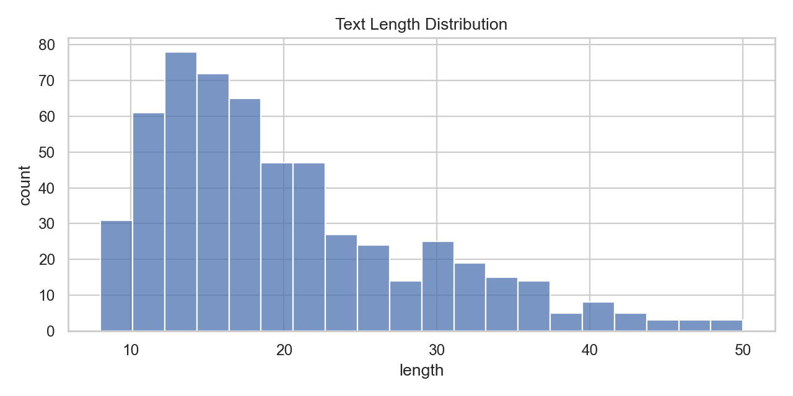

# Step 2 — 탐색적 데이터 분석(EDA) 리포트

## 데이터 개요 및 품질 요약
- **Raw rows**: 1000
- **필수 컬럼 누락**: 0 (없음)
- **필수 컬럼 결측/공백 행(원본 기준)**: 584
- **필수 컬럼 결측/공백 행(text/raw_text 보정 후)**: 0
- **text 공백을 raw_text로 보정한 행 수**: 0
- **text_id 결측을 생성으로 보정한 행 수**: 584
- **중복 후보(원문/dedup_key)**: 515/431
- **PII(URL/EMAIL/PHONE)**: 0/0/0

### 분포
- **도메인(provider_type)**
  - HOSPITAL: 380
  - CHECKUP_CENTER: 320
  - PHARMACY: 300
- **source_type**
  - inquiry: 302
  - review: 301
  - faq: 200
  - dataset: 100
  - notice: 97

## 전처리 요약(전처리규정 v1)
- **before rows**: 1000
- **after rows**: 566
- **dedup 제거 건수**: 424
- **(임시) 룰 기반 라벨 보완 적용**: True
- **(임시) 라벨 보완 건수(sentiment/topic)**: 273/273
- **정규화 텍스트 길이(min/max)**: 8/50
- **평균 토큰 수**: 5.181978798586573

## 1) 텍스트 길이 분포

## 2) 빈도 키워드 분석

### Top 10 키워드

| 순위 | 키워드 | 빈도 |
|---:|---|---:|
| 1 | 예약 | 88 |
| 2 | 검진 | 68 |
| 3 | 가능합니다 | 44 |
| 4 | 가능한가요 | 34 |
| 5 | 진료 | 33 |
| 6 | 어떻게 | 33 |
| 7 | 복용 | 30 |
| 8 | 시간이 | 28 |
| 9 | 대기 | 27 |
| 10 | 하나요 | 26 |

## 3) 데이터 유형별 분포(시각화)

### 3.1 sentiment_label 분포

### 3.2 topic_label 분포

## 4) 데이터 1000건 확장 요약

- **목표 총 건수**: 1000건
- **목표 분배율**: inquiry=30%, review=30%, faq=20%, dataset=10%, notice=10%
- **확장 전**: 412건
- **확장 후**: 1000건
- **추가 생성**: 588건

### source_type 분포 비교 (412건 → 1000건)

| source_type | 확장 전 | 확장 후 | 증가 |
|---|---:|---:|---:|
| dataset | 51 | 100 | +49 |
| faq | 111 | 200 | +89 |
| inquiry | 103 | 300 | +197 |
| notice | 44 | 100 | +56 |
| review | 103 | 300 | +197 |

## 5) 산출물 목록(out/)

- `out/step2_quality_report.md`, `out/step2_quality_report.json`
- `out/step2_preprocessed.csv`, `out/step2_preprocess_summary.json`
- `out/eda_length_hist.png`, `out/eda_top_keywords.csv`
- `out/eda_sentiment_distribution.png`, `out/eda_topic_distribution.png`
